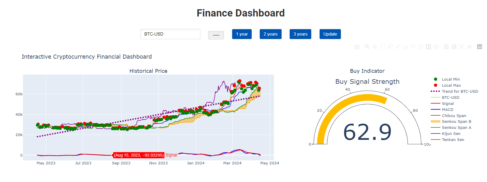

  # Cryptocurrency Finance Dashboard 💼
 
**Basically, it consists of a finance dashboard focused on cryptocurrencies.**

 ## Project Objectives 🎯
 
 The dashboard is not just a tool, it's a bridge to achieve several significant goals:

- Creating a portfolio for contributors
- Helping the development community
- Development of analysis

## Libraries used
- request
- yfinance
- plotly
- pandas
- numpy

